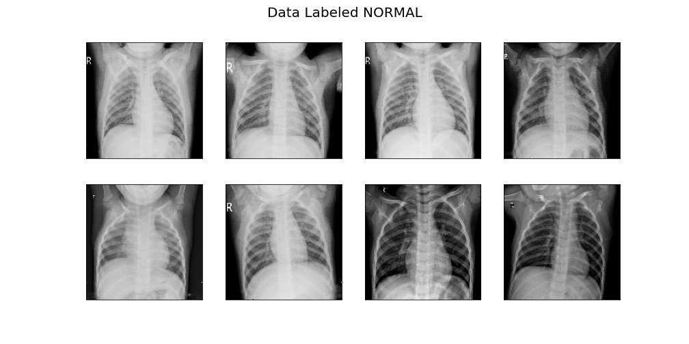
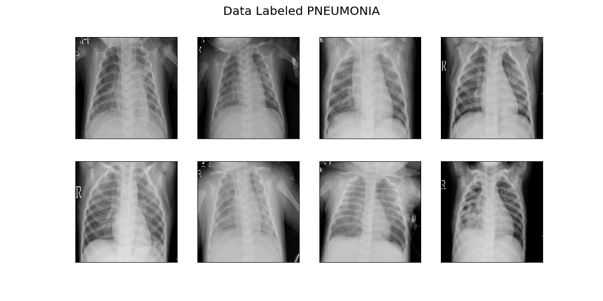
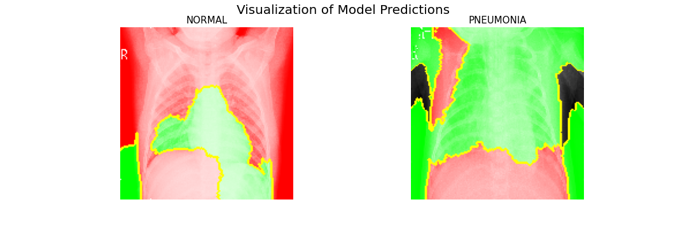

# **Neural Network Detection of Pneumonia in Chest Radiographs**

##### Author: Spencer Hadel
***
### Overview

According to the World Health Organization, pneumonia accounts for 14% of all deaths of children under 5 years old. Also according to the WHO, pneumonia can be prevented but only one third of children who have it receive the antibiotics they need. More information [can be found here](https://www.who.int/news-room/fact-sheets/detail/pneumonia).

A new artificial intelligence based medical research company, **Medecins Sans Limites (MSL)**, has launched a number of initiatives to create Neural Networks which aid the globe in solving crises like this one. The current project aims to accurately predict pneumonia based on chest radiography. 

The diagnosis of pneumonia requires a highly trained medical professional, as well as a variety of lab tests and a deep analysis of the patient's medical history and other symptoms. *MSL* does not aim to replace every step of the medical diagnosis process, as the human element of understanding other facts about a patient still remain. The objective is to create a highly accurate and sensitive model that can help medical professionals identify cases they need to treat based on the x-rays. 

This will be particularly useful in developing nations and parts of the world where circumstances inhibit access trained medical staff or equipment. If successful, it also stands to aid areas with full access to medical care, either providing a second opinion or helping confirm medical diagnoses.
***

## Data

The [data for this peoject is from this source on kaggle](https://www.kaggle.com/datasets/paultimothymooney/chest-xray-pneumonia), and states the following: 

"Chest X-ray images (anterior-posterior) were selected from retrospective cohorts of pediatric patients of one to five years old from Guangzhou Women and Children’s Medical Center, Guangzhou. All chest X-ray imaging was performed as part of patients’ routine clinical care."

The dataset is organized into 3 folders (train, test, val) and contains subfolders for each image category (Pneumonia/Normal). There are 5,863 X-Ray images (JPEG) and 2 categories (Pneumonia/Normal).

According to the source of the data:

*"all chest radiographs were initially screened for quality control by removing all low quality or unreadable scans. The diagnoses for the images were then graded by two expert physicians before being cleared for training the AI system. In order to account for any grading errors, the evaluation set was also checked by a third expert."* 

The first step this analysis takes is to create image data generators, which create useable train, test, and validation datasets. Each of these datasets contained 2 classes, **0 and 1** denoting whether the image showed a case labeled as **NORMAL or PNEUMONIA**, respectively.

Some samples of what NORMAL and PNEUMONIA images look like are below (taken from the validation set of data):




## Methods

This project creates multiple **Convolutional Neural Networks** in order to create a high performing **Binary Classification Model** for identifying patients with and without pneumonia.

An important thing to observe in each model is the performance throughout epochs, particularly the *Accuracy and Loss* of both the *Training and Validation* data throughout the training process of each model.

We also use *Confusion Marices* to show each model's predictions on the test data for each iteration of the project. This shows how many times a given model makes each prediction (0 or 1, since this is a binary classification problem), and whether that prediction matches the actual label of the image.

Additionally, we use certain metrics to identify how effective each model was when making predicitons on the test data, iterating on each successful outcome.

> * Binary Accuracy: Accuracy is of course, important. It will tell us how well our model successfully predicts cases of pneumonia. Ideally, we will always want our accuracy score to go up. Without an accurate model, there is no valuable outcome for this analysis. Binary accuracy is a built in keras metric used specifically for binary classification problems like this one.
> * Loss: The Loss of each model can be observed in the model.fit phase of the analysis. This metric will be a rough understanding of how our model is performing. Ideally, loss will get smaller throughout training epochs as well as throughout the iterative modeling process.

The following two metrics are important when testing each model's performance on the test data:
> * Recall (a.k.a. Sensitivity): __Recall is crucial__ in this analysis, particularly when evaluating our model against the test data. This metric will show us our model's ability to __avoid False Negatives__, or in other words to __prevent misdiagnosing someone as healthy when in reality they are ill__. 
> * Precision: Our final significant metric explains how many of the Predicted Positives of our model are correct. This is important to avoid misdiagnosing a patient as ill, but is also less crucial than the other metrics as the primary goal is to help people in need.

Throughout the iterative process, we implemented various methodologies.

One method in particular was the *Data Augmentation* on the training data, which alters the images to train our model on more general features of the data instead of overfitting on specifics that would be harmful to its performance. An example of these augmented images can be seen below:


Another important method was the *Dropout Regularization* step that was taken to train the model more generally once more. This process literally makes the model "drop out" some of the trained neurons.


## Results

Our baseline model's Accuracy and Loss Visualizations can be seen below:


And this is the Confusion Matrix for the same model:


The final model chosen based on highest performance, however, produced these results:


Below is a comparison of every model tested in this project as well as their performance metrics:


There is also a visualization to give a basic understanding of how our model is identifying the information in each image:




***

## Conclusion
The final model clearly shows a drastic improvement over the baseline, and accurately predicts patient x-rays as having pneumonia while also maintaining a high recall score, thus not misdiagnosing a patient as healthy when they are in critical need of care.

With __91% accuracy__ and __98% recall__ scores, the model easily scores highly enough to be trusted with real world applications, and Medecins Sans Limites should have great success aiding medical professionals and communities in need across the globe.

### Next Steps

This model seems to be ready for deployment in the medical fields where it is most needed. However, there are a few other steps that can be taken to supplement this success:

> Additional models could be investigated for similar instances to this one. For example, can we build a model that can accurately predict Pneumonia on other age groups, or perhaps even one model for *all* age groups?

> Additional data collection may help to further improve model performance.

> The model could be adjusted to account for multiple classifications, such as other types of Pneumonia or other illnesses detectable in chest x-rays

***

## More Information
The iterative model testing and interpretation of results can be found [in this jupyter notebook, index.ipynb](./index.ipynb)

## Repository Structure

```
├── data
├── img
├── models
├── README.md
├── index.ipynb
├── xray_pneumonia_pres.pdf
```